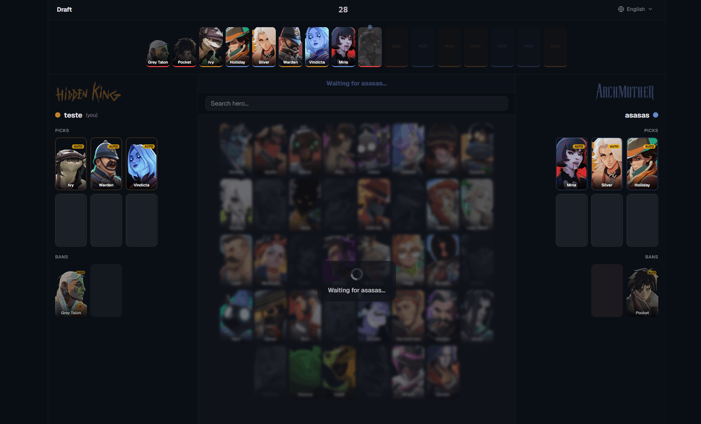

# Deadlock Draft

Real-time pick & ban draft tool for [Deadlock](https://store.steampowered.com/app/1422450/Deadlock/) competitive matches.



## Features

- **Real-time** - WebSocket-powered live updates via Socket.IO
- **Stream mode** - Hide team URLs, chroma-key support for OBS overlays
- **Customizable formats** - Standard, mini tournament, watchparty, simple, advanced
- **Auto-timer** - Configurable turn timer with auto-pick on expiry
- **Public API** - Create drafts programmatically and receive results via webhook
- **i18n** - English, Portuguese, Spanish, Russian

## Getting Started

```bash
pnpm install
pnpm dev
```

The server starts at `http://localhost:3000`.

## How It Works

1. Create a draft at `/new` with team names, format, and timer
2. Share the generated URLs with each team captain
3. Teams pick and ban heroes in real-time
4. Stream view available for spectators/OBS overlays

## API

See the [API documentation](https://draft.deadlock.pro.br/docs) for details on creating drafts programmatically and receiving webhook results.

### Quick Example

```js
const res = await fetch('https://draft.deadlock.pro.br/api/draft', {
  method: 'POST',
  headers: { 'Content-Type': 'application/json' },
  body: JSON.stringify({
    name_a: 'Team Alpha',
    name_b: 'Team Bravo',
    sort: 'a#-b#-a1-b2-a2-b1-b#-a#-b1-a2-b2-a1',
    timer_seconds: 30,
    callback_url: 'https://your-server.com/webhook',
  }),
})

const { data } = await res.json()
// data.code_url, data.code_a, data.code_b, data.code_admin
```

## Tech Stack

- [Next.js](https://nextjs.org) 15 + React 19
- [Socket.IO](https://socket.io) for real-time communication
- [Express](https://expressjs.com) custom server
- [better-sqlite3](https://github.com/WiseLibs/better-sqlite3) for persistence
- [Tailwind CSS](https://tailwindcss.com) v4 + [shadcn/ui](https://ui.shadcn.com)
- [Helmet](https://helmetjs.github.io/) + rate limiting for security

## Environment Variables

| Variable | Default | Description |
|----------|---------|-------------|
| `PORT` | `3000` | Server port |
| `NODE_ENV` | `development` | Set to `production` for production |
| `BASE_URL` | `http://localhost:3000` | Public base URL (used for cover URLs and webhooks) |
| `NEXT_PUBLIC_HEROES_API_URL` | `https://assets.deadlock-api.com/v2/heroes` | Deadlock Heroes API endpoint |

## Scripts

| Command | Description |
|---------|-------------|
| `pnpm dev` | Start development server |
| `pnpm build` | Build for production |
| `pnpm start` | Start production server |
| `pnpm test` | Run tests |
| `pnpm test:watch` | Run tests in watch mode |

## License

MIT
